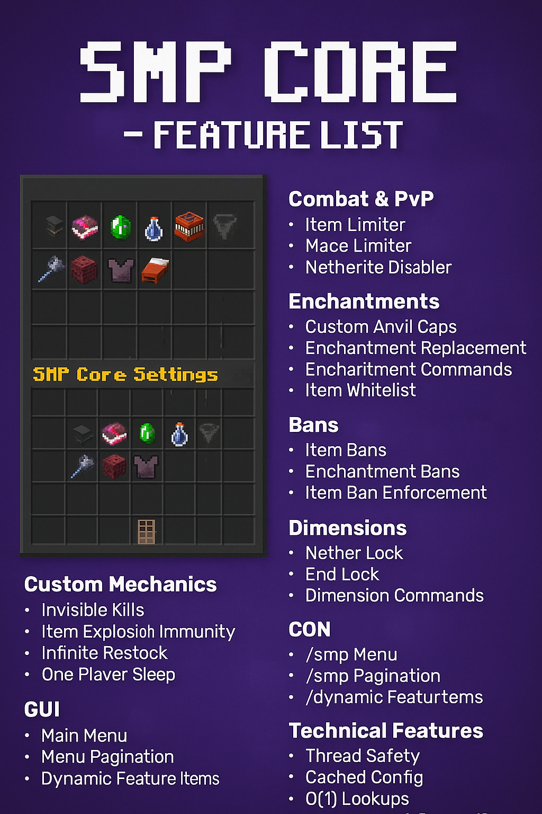

# Vanilla Core

[](https://github.com/TejasLamba2006/smp-core/actions/workflows/build.yml)
[](https://github.com/TejasLamba2006/smp-core/actions/workflows/codeql.yml)
[](LICENSE)
[](https://modrinth.com/plugin/vanillacorewastaken)
[](https://discord.gg/7fQPG4Grwt)

A comprehensive Minecraft plugin for SMP servers focused on **PvP balance**, **custom mechanics**, and **server management**. Built for Paper/Spigot 1.21.1+.

<!--  -->

> **🎉 Open Source!** This project is now open source. We welcome contributions from the community!

---

## ✨ Features

### ⚔️ Combat & PvP

- **Item Limiter** - Limit how many of specific items players can carry (gaps, totems, pearls, etc.)
- **Mace Limiter** - Server-wide mace crafting limit with broadcast announcements
- **Netherite Disabler** - Prevent use of netherite gear (configurable per item type)

### 📖 Enchantments

- **Custom Anvil Caps** - Prevent enchantments from exceeding set levels via anvil/enchanting table
- **Enchantment Replacement** - Automatically scan and reduce overpowered enchantments on items
- **Item Whitelist** - Mark specific items as exempt from enchantment scans

### 🚫 Bans

- **Item Bans** - Ban maces, anchors, crystals, pearls, netherite items
- **Potion Effect Bans** - Config-driven list of banned potion effects

### 🌍 Dimensions

- **Nether Lock** - Toggle access to The Nether
- **End Lock** - Toggle access to The End

### ⚙️ Custom Mechanics

- **Invisible Kills** - Hide killer name in death messages when invisible
- **Item Explosion Immunity** - Protect dropped items from explosions
- **Infinite Restock** - Villagers never run out of trades
- **One Player Sleep** - Only one player needs to sleep to skip night

### 🖥️ GUI System

- **Main Menu** - `/smp` opens a paginated GUI showing all features
- **Dynamic Feature Items** - Toggle features with left-click, configure with right-click
- **Menu Pagination** - Automatically handles many features across multiple pages

---

## 📋 Commands

| Command | Description | Permission |
|---------|-------------|------------|
| `/smp` | Opens the main settings menu | - |
| `/smp menu` | Opens the main settings menu | - |
| `/smp reload` | Reloads all configurations | `vanillacore.reload` |
| `/smp enchant <sub>` | Enchantment management | `vanillacore.enchant` |
| `/smp mace <sub>` | Mace limiter commands | `vanillacore.mace` |
| `/smp netherite <sub>` | Netherite disabler commands | `vanillacore.netherite` |

### Enchantment Subcommands

- `/smp enchant limit <enchant> <level> [anvil|replacement|both]`
- `/smp enchant unlimit <enchant> [anvil|replacement|both]`
- `/smp enchant block <enchant> [anvil|replacement|both]`
- `/smp enchant unblock <enchant> [anvil|replacement|both]`
- `/smp enchant list` - Show all configured limits
- `/smp enchant scan` - Manually scan your inventory
- `/smp enchant whitelist` - Toggle whitelist on held item

---

## 📥 Installation

### For Server Owners

1. Download from [Modrinth](https://modrinth.com/plugin/vanillacorewastaken)
2. Place the JAR in your server's `plugins` folder
3. Restart or reload your server
4. Configure features in your plugin folder `config.yml`
5. Use `/smp reload` to apply changes or `/smp` to use the GUI

### For Developers

```bash
# Clone the repository
git clone https://github.com/TejasLamba2006/smp-core.git
cd smp-core

# Build with Maven
mvn clean package

# The compiled JAR will be in target/
```

See [CONTRIBUTING.md](CONTRIBUTING.md) for development guidelines.

---

## ⚙️ Configuration

All features are **disabled by default** and fully configurable via `config.yml`.

<details>
<summary>Example: Item Limiter Configuration</summary>

```yaml
features:
  item-limiter:
    enabled: false
    check-method: "on-hit"  # or "on-move"
    limits:
      golden_apple: 4
      enchanted_golden_apple: 1
      totem_of_undying: 1
      end_crystal: 2
      ender_pearl: 8
```

</details>

<details>
<summary>Example: Enchantment Caps Configuration</summary>

```yaml
features:
  custom-anvil-caps:
    enabled: false
    block-enchanting-table: true
    block-anvil: true
    keep-only-best-protection: true
    caps:
      sharpness: 4
      protection: 3
      power: 4
      unbreaking: 2
```

</details>

<details>
<summary>Example: Mace Limiter Configuration</summary>

```yaml
features:
  mace-limiter:
    enabled: false
    max-maces: 1
    title:
      enabled: true
      title: "§6⚔ MACE CRAFTED ⚔"
      subtitle: "§e{player} §7has crafted mace §e#§6{count}"
    chat:
      enabled: true
      message: "§6{player} §ehas crafted mace #§6{count}§e!"
    sound:
      enabled: true
      sound: "ENTITY_ENDER_DRAGON_GROWL"
```

</details>

---

## 🔧 Requirements

- **Server**: Paper or Spigot 1.21.1+
- **Java**: 21 or higher

---

## 📊 Technical Features

- **Thread-Safe** - All managers use concurrent data structures
- **Performance Optimized** - O(1) feature lookups, cached configs, cooldown systems
- **Memory Safe** - Proper cleanup on player quit, no memory leaks
- **Hot Reload** - All configs can be reloaded without restart

---

## 🤝 Contributing

We welcome contributions! Here's how you can help:

- 🐛 **Report bugs** using [issue templates](.github/ISSUE_TEMPLATE/bug_report.yml)
- ✨ **Suggest features** using [feature requests](.github/ISSUE_TEMPLATE/feature_request.yml)
- 💻 **Submit pull requests** following our [contributing guidelines](CONTRIBUTING.md)
- 📖 **Improve documentation** in the [docs folder](docs/)
- ⭐ **Star the repository** if you find it useful!

### Development

```bash
# Fork and clone the repository
git clone https://github.com/YOUR_USERNAME/smp-core.git

# Create a feature branch
git checkout -b feature/amazing-feature

# Make your changes and test
mvn clean package

# Commit and push
git commit -m "Add amazing feature"
git push origin feature/amazing-feature

# Open a Pull Request
```

Read the full [Contributing Guide](CONTRIBUTING.md) for detailed information.

---

## 🐛 Issues & Support

- **Bug Reports**: Use our [bug report template](.github/ISSUE_TEMPLATE/bug_report.yml)
- **Feature Requests**: Use our [feature request template](.github/ISSUE_TEMPLATE/feature_request.yml)
- **Discord**: Join our [Discord server](https://discord.gg/7fQPG4Grwt) for quick help
- **Documentation**: Check the [full documentation](https://vanillacore.tejaslamba.com)

---

## 📜 License

This project is licensed under the **MIT License** - see the [LICENSE](LICENSE) file for details.

You are free to use, modify, and distribute this software. See [docs/license.md](docs/docs/license.md) for more information.
